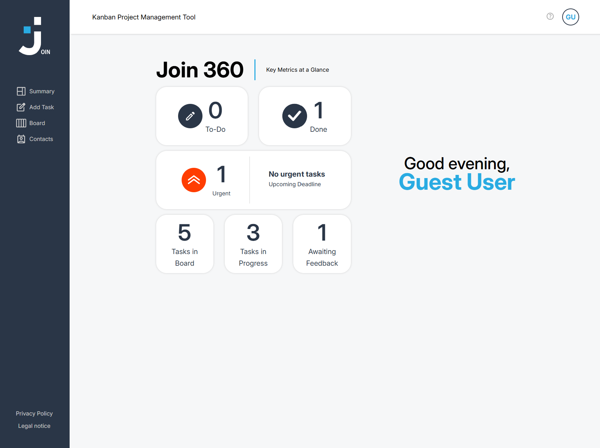

# 📋 Join

A Kanban-based task management application inspired by modern project management tools.  
Create tasks, organize workflows, assign users, and manage projects with drag-and-drop functionality.

---

## 🚀 Live Demo

🔗 [Play now](https://join.kevin-staebler.de/index.html)

---

## 🎮 Features

- 📌 Kanban task management system
- 🖱️ Drag-and-drop functionality
- 👥 User assignment system
- 📝 Create and edit tasks
- 📅 Task categories & priorities
- 🔍 Search functionality
- 📱 Responsive design
- 🔥 Firebase integration
- 🎨 Modern UI & animations

---

## 📸 Screenshot



---

## 🛠️ Tech Stack


---

## ⚡ Installation

Clone the repository:

```bash
git clone https://github.com/kevinstaebler94/join.git
```

Open the project folder and start the `index.html` file in your browser.

---

## 👨‍💻 Developer

Kevin Staebler  
Aspiring Frontend Developer from Germany 🇩🇪
